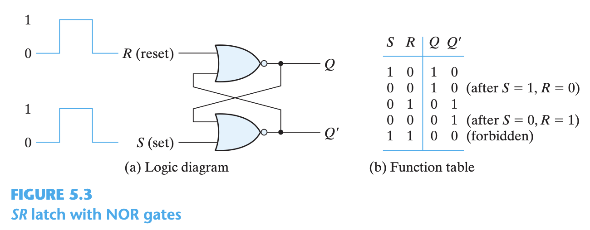

# Computer Architecture I

## CH1 Digital Systems and binary numbers

- Verilog HDL
  - Hardware Description Language
  - not a program but similar for describing models
-

### Non base 10 number systems

- decimal system base 10
- binary system base 2
  - 2^10 = kilo = 1024
  - 2^20 = mega = 1,048,576
  - 2^30 = giga
- hexadecimal sys base 16
- binary => hexadecimal

> 1010 1010 1010 = _ + 160 + 10 = A A A
    -   every 4 digits in binary = 1 digit in hex

- any base number conversion
 (##.##)_base = ## * base^digitpos
  - ones place is 0, decimals are negative
- base 10 => binary, 100 = 1100100
    > #%2 = d_1 + r_0 => a_0 = r_0
    > d_1%2 = d_2 + r_1 => a_1 = r_1
- N_10 < 1 => binary
    > N * 2 > 1 :  a_-1 = N > 1
- **fractions_10 to base-x**
- base 10 => base r=2 :  ( 0.63 )_10_ == ( 0.1010... )_2_
    > n _r = (a_-1).f_1   =1.26
    > f_1_r = a_-2.f_2   = 0.52, 1.04, 0.08  
  - ( 3.14 )_10_ => (11.00100011)_2_ => ( 3.02033113 )_4_

### 1.5 Complements

- used to simplify subtraction operations
- complements one lower than the base (r) = string of the complement - N
  - diminished complement ~ r-1 complement
        > r^n - 1 - N
  - radix complement ~ r's complement
        > r^n - N
        > diminished complement + 1
  - decimal =>
    - 9's complement
      - 999999999 - N, len of 9 is same as number of digits
    - radix complement
  - binary =>
    - 1's complement
      - 111111 - N = complement
      - 1 => 0
      - flip all bits 0101 => 1010
    - radix complement (2s complement)
      - 1's complement + 1 == 2's complement
- subtraction of M - N = Minuend - Subtrahend
    > M - N
    > = M  + (radix complement of N)
    > = M + ( r^n - N )
    > = M - N + r^n
      - remove carry if pos else
      - if no carry the answer is negative so do a radix on ans
  - M + rc(N) == M + drc(N) + 1
  - adding to dimished complement -> d complement => subtracting

### 1.6 signed binary numbers

- unsigned ~ absolute number
  - left most digit is most significant
- signed ~ can be negative or positive based on laft most bit
  - second digit from left is most significant
  - complements will skips the left most bit because it represents the sign of Na
  - ( -9 ) = 10001001
    - signed‐magnitude representation:          10001001
      - does not appear as useful,
      - flip all except sig digit to get 1's complement
    - signed‐1’s‐complement representation:     11110110
      - easy for human computation
      - add one to get signed 2
    - signed‐2’s‐complement representation:     11110111
      - useful in computer arithmatic for simple addition

### 1.7 binary codes

- 4 bit codes
  - each of the following codes has a different set of unused bit combinations
  - BCD (8421)
    - 4 digit binary representing [0 - 9] = [ 0000 - 1001 ]
      - the rest of the combos are excess and unused
    - every set of 4 represent a single digit in decimal
          > (185)_10 == (0001 1000 0101)_BCD == (10111001)_2
  - ecxess-3 code (8421)- 0011
    - 0 starts 3 ~ 0011     [ 0 - 9 ] == [0011 - 1100]
    - 2421
    - binary                [ 0 - 15 ] == [ 0000 - 1111]
    - 8,4,-2,1
  - gray code
    - for continously changing numbers
    - difference between different digits is represented by single binary digit changes so that no intermediate carries are apparent
      >
          0000    0   1100    8
          0001    1   1101    9
          0011    2   1111    10
          0010    3   1110    11
          0110    4   1010    12
          0111    5   1011    13
          0101    6   1001    14
          0100    7   1000    15

- character representations

  - ASCII ~ 7 bit for 128 combinations
  - letters U &L, 32 symbols, 34 control/non printing chars
  - most computers uses 8bit (==bytes) with sig digit for other purposes
    - more smybols, terminal
    - Error detection through even parity or odd parity
        > 10010011 even number of 1 bits in even parity => ACK 00000110
        > 10000011 odd 1bits in even parity => NAK error response 10010101

### 1.8 binary storage and registers

- binary cells ~ 2 stable PHYSICAL states for 1 bit of information ~ [ 0 1 ]
  - voltage state
- **register** ~ group of binary cells
- fixed number of bits to codify a set number of values
- 2^n different combinations
  - range `[ 0 - 2^n )`

### 1.9 Binary Logic

- binary logic assumes 2 distinct states, { { True | False }, { 1 | 0 } }
- Logic Gate
  - circuits operating
  - voltage = analog signam w/ values over continous range
    - converted in to discrete digital signal { 0 | 1 }
        > if voltage range = [ 1 , 3]
        > [ 2 , 3 ] -> 1
        > ( 1 , 2 ) -> indeterminate
        > [ 0 , 1 ] -> 0

## CH2 Boolean Algebra and Logic Gates

### 2.1 Introduction

### 2.2 Basic Definitions

- Boolean Algebraic properties
  - closure
  - associative ~ a(bc) = (ab)c
  - communitative ~ a*b = b*a
  - identity ~
    - multiplicative identity ~ x*i = x => i=1, or i=x
    - additive identity~ x+i = x => i=0, or i=x
  - inverse { x , x' }
    - multiplicated inverse x * x' = 0
    - additive inverse ~~ x + x' = 1
  - distributive law ~ a (b+c)=(a b)+(a c)

### 2.3 Axiomatic Definition of Boolean Algebra

1. closure
    - he structure is closed with respect to the operator +
    - The structure is closed with respect to the operator *
2. identity
    - The element 0 is an identity element with respect to `+` that is, x + 0 = 0 + x = x.
    - The element 1 is an identity element with respect to `*` that is, x 1 = 1 x = x.
3. communicative
    - The structure is commutative with respect to `+` that is, x + y = y + x
    - The structure is commutative with respect to `*` that is, x *y = y*x.
4. distributive
    - The operator `*` is distributive over `+` that is, x (y + z) = (xy) + (xz).
    - Theoperator `+` isdistributiveover `*` that is, x + (y*z) = (x + y)*(x + z).
5. sinverse
    - ∀ x∈B, ∃ x ∈ B st. x + x' = 1 and x * x' = 0.
6. There exist at least two elements x, y ∈ B such that x != y.

### 2.4 Basic Theorems and Properties of Boolean Algebra

- Order Precedence
>
    () -> NOT -> AND -> OR == () -> ' -> * -> +
    p2    zero            x+0 = x             x*1 = x
    p5    inverse         x+x' = 1            x*x' = 0
    T1    self identity   x+x = x             x*x = x
    T2    state identity  x+1 = 1             x*0 = 0
    T3    involution      (x')' = x           double neg
    p3    commutative     x+y = y+x           xy = yx
    T4    Associative     x+(y+z) = (x+y)+z   x(yz) = (xy)z
    p4    Distributive    x(y+z) = xy + xz    x+yz = (x+y)(x+z)
    T5    DeMorgan        (x+y)' = x'y'       (xy)' = x'+y'       OR<=>AND
    T6    Absorption      x+xy = x            x(x+y) = x

### 2.5 boolean functions

- Logical operators
  - AND   ->  x * y   ^   D
  - OR    ->  x + y   v   )>
  - NOT   ->  x'=x‾   ~   |>o
  - XOR   ->  ⨁           ))>
  - NAND                  Do
  - NOR                   )>o
- Truth Table
  >
  >|  x   |   y   |   x*y |   x+y |   x⇒y |
  >|:-----:|:-----:|:-----:|:-----:|:-----:|
  >|  0   |   0   |   0   |   0   |   1   |
  >|  0   |   1   |   0   |   1   |   1   |
  >|  1   |   0   |   0   |   1   |   0   |
  >|  1   |   1   |   1   |   1   |   1   |
  >
- Boolean functions = binary var, const { 0, 1 }, logical operators
  - F_1 = x + y¹z, x=y=z=0 => 0 + 0¹*0 = 0+ 1*0 = 0
- Algebraic Maniputation => simplification of circuits => cost savings

- consensus theorum
  - xy + x'z + yz = xy + x'z        yz absorbed
  - (x + y)(x' + z)(y + z) = (x + y)(x' + z) = x'y + xz
- complement of a function
  - F => F' through DeMorgan's Theorum
    - (a+b+c...)' <=> a'b'c'...
    - (abc...)' <=> a'+b'+c'

### 2.6 Canonicaland Standard Forms

- minterms maxterms
  - binaries can be in 2 forms x & x' (complement)
  - minterm <= deMorgan complement => maxterm
  - **minterm**
    - standard product combination of AND terms
      - x and y => 4 minterms {xy, xy', x'y, x'y'} ~ 2^n possible terms
    - any boolean function represented by `sum(OR)` of minterms that produce `1(True)`
      - f_1 = xyz + xy'z + xy'z' == m_4 + m_5 + m_7
    - complemnt of boolean function == sum of minterms of 0
      - f_1' = == m_0 + m_1 + m_2 + m_3 + m_6
      - the complement of f_1' by deMorgan produces the maxterm version  
  - **maxterm**
    - standard sums: combination of OR terms
      - x and y => 4 maxterms { x+y, x+y', x'+y, x'+y'} ~2^n possible terms
    - f = product of Maxterms with output=0 with each term's complement
    - complement of f_1' ~by demorgan~> f_1
      - f_1 = (x+y+z)(x+y+z')(x+y'+z)(x'+y'+z) == M_0 (M_1) M_2 (M_3) M_6
  - **cannonical form**: boolean function expressed as `∑()` || `∏()`
    - also concidered standard form
    >
        sum of minterms     F   ==  ∑(4,5,7)      ==  ∏(0,1,2,3,6)
        product of maxterms F'  ==  ∑(0,1,2,3,6)  ==  ∏(4,5,7)
  - **standard form**
    - sum of products or product of sums
      - does not need to include every literal in each term like cannonical form
      - sum of minterms or product of maxterms
      >
          F   ==  ∑(4,5,7)  ==  xy'z'+xy'z+xyz  ==  xy'??

  
### 2.7 Other Logic Operations

- 2^2n = number of binary functions for `n` inputs

### 2.8 Digital Logic Gates

- NOT ~ bubble ~ inverter ~ negation
- triangle ~ buffer ~ transfer ~ no logic but amplifies signal

- Extension to Multiple Inputs
- Positive and Negative Logic
  - poositive logic system uses high voltage to represent 1
  - negative logic system uses low voltage to represent 0

### 2.9 Integrated Circuits

- IC (CHIP) silicon semiconductor crystal
- levels of integration
  - categorized by complexity/num of logic gates
  - small scale integration (SSI) < 10 gates and external pins
  - medium scale integration (MSI) < 1000
    - elementary digital operations: decoders, adders, multiplexers
  - large scale integration (LSI) < 10000
    - digital systems: processors, memory chips, programmable logic
  - very large scale integration (VLSI) < millions
    - large memory arrays and complex microcomputer chips
- Digital logic libraries
  - classification by circuit technology: digial logic family
  - Fan‐out
    - specifies the number of standard loads that the output of a typical gate can drive without impairing its normal operation. A standard load is usually defined as the amount of current needed by an input of another similar gate in the same family.
  - Fan‐in
    - is the number of inputs available in a gate.
  Power dissipation is the power consumed by the gate that must be available from the power supply.
  - Propagation delay
    - is the average transition delay time for a signal to propagate from input to output. For example, if the input of an inverter switches from 0 to 1, the output will switch from 1 to 0, but after a time determined by the propagation delay of the device. The operating speed is inversely proportional to the propagation delay.
  - Noise margin
    - is the maximum external noise voltage added to an input signal that does not cause an undesirable change in the circuit output.
- Computer‐Aided Design of VLSI Circuits

## 3 Gate‐Level Minimization

### 3.1 Introduction

- Gate‐Level Minimization = design optimization of gate level implementations
  - for minimizing boolean algebraic functions
  - simplified forms should be in standard form (no xor)

### 3.2 The Map Method

- Karnaugh map or K-map
  1. conversion to standard form (sum of products || product of sums)
  2. use a graphical table to visually convert the standard form of minterms => to the optimized form with the minimum number of terms, and literals per term
  - two-variable k-map
    
    m1+m2+m3 => x+y
  - three-variable k-map
    
    - gray code sequence, so that adjacent squares only have one bit diff
      - for any minterms next to each other, replace with one term keeping like literals, and removing dissimilar literal
        - inverse absorption
        - xy'z + xyz = xz

### 3.3 Four‐Variable K-Map

  

### 3.4 Product‐of‐Sums Simplification

- using a different form using more OR Gates instead of AND gates
  >
    F = ∑(1,2)
    F' = ∑(0,3)
    F = ∏(1,2)

### 3.5 Don’t‐Care Conditions

- Inputs that are unused, do not produce viable outputs
- these nodes on the k-map can be concidered 0 or 1 depending on the need

### 3.6 NAND and NOR Implementation

- NAND or NOR are universal gate that is used as the base of all gates
- NAND and NOR gates are mroe frequently used because they are easier to create
  - AND = NAND + Inverter
  - OR = Inverter + NAND
  
- Sum of product forms can be simplified using 3 NAND gates instead of 2AND+OR
  - F = AB + CD = ((AB)'(CD)')'
  
- using NOR gates as the universal base
  - used in product of sum forms = 3 NOR gates
  - AND = 2 inverter + NOR
  - OR = NOR + interter
  
  

### 3.7 Other Two‐Level Implementations

### 3.8 Exclusive‐OR Function

- XOR
  - chained XOR = true with odd number of trues

### 3.9 Hardware Description Language (HDL)

- language for describing language in textual form
- documentation language for prototyping logic
- design entry - creates an HDL-based description of the functionality that is to be implemented in hardware
- logic simulation - displays behavior of a digital system
- logic synthesis - the process of deriving a list of physical components and their interconnections (called a netlist) from the model of a digital system described in an HDL
- Timing verification confirms that the fabricated, integrated circuit will operate at a specified speed
- two standard HDL Languages IN IEEE
  - VHDL - very high speed IC Hardware Descriptiton language
    - VHSIC = very high speed IC
    - more difficult to learn
  - Verilog HDL
    - OPEN SOURCED
    - .v, .verilog, .vlg, or .vh
- Gate Delays
  - in ns, how long to travel from input to out of the gate

## 4 Combinational Logic

### 4.1 Introduction

- sequential circuits
  - uses storage elements in addition to logic gates
  - output depends on current inputs AND state of storage element
    - uses output from prev inputs
- combination circuits (focus)
  - output depends on current inputs
  - consists of only logic gates and inputs
- binary analog signals -> boolean algebra -> logic gates -> binary codes
  - analyze logic circuit behavior => circuit synthesis => HDL hardware description language for circuits
- common circuits become integrated circuits in standard components
  - widely used parts/ building blocks of a chip
  - integrated circuits of (MSI) medium scale circuits
  - standard cells in (VLSI) very large scale integrated circuits
    - such as ASICs application-specific integrated circuits
    - usage is analagous to multiple-IC MSI design

### 4.2 Combinational Circuits

- storage register -> n inputs -> Combinational circuit => m outputs -> storage register
  - n inputs => 2^n possible outputs
- curr task
  1. analyze circuit behavior
  2. circuit synthesis (optimized)
  3. HDL model
- standard circuits == integrated circuits
  - common circuits used as foundations for other circuits
  - adders, subtractors, comparators, decoders, encoders, and multiplexers

### 4.3 Analysis Procedure

- combinational circuit diagram
  - has logic gates with no feedback paths or memory elements.
- boolean algebra substituion
- reverse engineering from circuit diagram => truhtable => boolean function
  1. get number of inputs
  2. identify important intersections and outputs + label them
  3. generate truth table for inputs for each layer of gates and identified gates
  4. generate boolean function if not done already based on truth table

### 4.4 Design Procedure

- specs -> logic diagram, design procedure
  1. specifications => # inputs and outputs & assign symbols for each
      - x,y,z => a,b,c
  2. derive truth table
  3. optimize/simplify boolean function
  4. draw logic diagram
- design conciderations
  - #inputs, #gates, propagation time, interconnections, driving capability of a gate

### 4.5 Binary Adder–Subtractor

- carry
  - when augend and addend contain more significant bits, the carry is added to the next higher order pair of significant bits
  - augend but + addend bit = carry bit

#### Half adder

- combination circuit that adding of 2 bits to produce two bits
  - S = xy' + x'y
  - C = xy

#### Full adder

- combination of 2 half adders
  - S = x'y'z + z'yz' + xy'z + xyz  ==  xyz + (x⨁y)⨁z
  - C = xy + xz +yz
- input of 3 bits (2 from digit and 1 from prev carry) => output 2 bits
- x, y, z => s, c
  
  
  

#### Binary Adder

- basic standard component
- 4 + 4 + c = 9 inputs => 5 outputs => 2^9=512 different outputs
- adding two 4 digit binaries to a 4 digit output and carry (5 digits)
- combination of 4 fulladders in sequecne

- Carry propagation
  - total propagation time = avg gate propagation *  num of levels of gates
  - limits the speed of addition, the most common arithmatic operation in circuits
  - Parallel binary adders uses carry look ahead gerator circuit to save time
  
  

#### Adder-Subtractor

- combinational circuit for binary adding and subtraction
- A - B => A + rc(B) => A + r(B) + M=1
  - the extra 1 can be the input carry C_0 in the full adder
  - M=0 : adds A+B, No change to B
  - M=1 : subtracts A-B, B is converted to 1's comp and 1 is added to C_0 ~ 2's comp
  
  - unsigned addition
    - C = overflow indicator
  - unsigned subtraction
    - C = borrow indicator
  - signed addition and subtraction
    - V = overflow detector when V=1
    - C = the new sign

### 4.6 Decimal Adder

- min of 9 inputs, 5 outputs

#### BD Decimal adder

### 4.7 Binary Multiplier

### 4.8 Magnitude Comparator

### 4.9 Decoders

- combinational circuit for converting binary information
  - n input lines => up to 2^n output lines
  - n-to-m-line decoders, m <= 2^n
    - ex: 3 to 8 line decoder == 3x8 decoder
    - m ~ num of min terms
    - only one of the outputs will be 1, rest = 0

  - decoder–demultiplexer
    - uses NAND for final output to select by 0 instead of using 1
    - demultiplexer uses seletion inputs to select a single line

  - combination of smaller decoders (3-8 decoder) with selection inputs to double the number of output signals
  - combination of 2 standard components may be cheaper alternative than creating a single purpurpose circuit

### 4.10 Encoders

- reverse of decoder
- 2^n input liens => n output lines

- Priority Encoder
  - ensures only only one input line is concidered at a time

### 4.11 Multiplexers

- ~data selector - selects one of the inputs and steers it to the output.
  - steers to the next boolean gate.
  - Selector input with OR gates at the end to capture out selected Inputs

- Example

- three state gates
  - AC = > Output[ A || high impedence(off/open circuit)]

<!--  -->
<!--  -->

### 4.12 HDL Models of Combinational Circuits

## 5 Synchronous Sequential Logic

### 5.1 Introduction

- sequential circuits can store information in memory, register

### 5.2 Sequential Circuits

- a sequential circuit is specified by a time sequence of inputs, outputs, and internal states
- synchronous
  - behaviour defined at discrete units of time
  - clocked sequential circuits
    - synced by clock generator: clock and clk
    - storage occurs on clock pulses

  - uses flipflop memory
- asynchronous
  - determined at any point in time
  - ordered
  - uses time delay devices

### 5.3 Storage Elements: Latches

- latches: Storage elements that operate with signal levels (rather than signal transitions)
  - level sensitive
- flip-flops: are controlled by a clock transition
  - edge sensitive
- latches are basic units: used to construct flipclops
- SR Latch
  - Set=>0,0=>Reset=>0,0
  - Set State = Q = 1
  - Reset State = Q' = 1
  - pulse ttravels from where the 1 is at(R or S) throughout the latch
  - 1,1 can cause indeterminate state => impossible error

- S'R' latch
  - pulse travels through the 0 throughout the NAND latch

- D Latch (Transparent Latch)
  - ensures no indeterminate states using
  - D Data input and En enable input => Q=1=Set, Q=0=Reset
  - Set state == D=1

### 5.4 Storage Elements: Flip‐Flops

- flip flops - storage element holding one bit of information
  - similar to a memoized selector
- D Flop Flop
  - uses two D Latches
  - Triggered on negative clock pulse(en) transition
- T Flip Flop
  - uses three D Latches
  - triggered on positive clock pulse transition

### 5.5 Analysis of Clocked Sequential Circuits

### 5.6 Synthesizable HDL Models of Sequential Circuits

### 5.7 State Reduction and Assignment

### 5.8 Design Procedure

## 6 Registers and Counters

### 6.1 Registers

### 6.2 Shift Registers

### 6.3 Ripple Counters

### 6.4 Synchronous Counters

### 6.5 Other Counters

### 6.6 HDL for Registers and Counters

## 7 Memory and Programmable Logic

### 7.1 Introduction

### 7.2 Random‐Access Memory

### 7.3 Memory Decoding

### 7.4 Error Detection and Correction

### 7.5 Read‐Only Memory

### 7.6 Programmable Logic Array

### 7.7 Programmable Array Logic

### 7.8 Sequential Programmable Devices

## 8 Design at the Register Transfer Level

### 8.1 Introduction

### 8.2 Register Transfer Level Notation

### 8.3 Register Transfer Level in HDL

### 8.4 Algorithmic State Machines (ASMs)

### 8.5 Design Example (ASMD Chart)

### 8.6 HDL Description of Design Example

### 8.7 Sequential Binary Multiplier

### 8.8 Control Logic

### 8.9 HDL Description of Binary Multiplier

### 8.10 Design with Multiplexers

### 8.11 Race‐Free Design (Software Race Conditions)

### 8.12 Latch‐Free Design (Why Waste Silicon?)

### 8.13 Other Language Features

## 9 Laboratory Experiments with Standard ICs and FPGAs

### 9.1 Introduction to Experiments

### 9.2 Experiment 1: Binary and Decimal Numbers

### 9.3 Experiment 2: Digital Logic Gates

### 9.4 Experiment 3: Simplification of Boolean Functions

### 9.5 Experiment 4: Combinational Circuits

### 9.6 Experiment 5: Code Converters

### 9.7 Experiment 6: Design with Multiplexers

### 9.8 Experiment 7: Adders and Subtractors

### 9.9 Experiment 8: Flip‐Flops

### 9.10 Experiment 9: Sequential Circuits

### 9.11 Experiment 10: Counters

### 9.12 Experiment 11: Shift Registers

### 9.13 Experiment 12: Serial Addition

### 9.14 Experiment 13: Memory Unit

### 9.15 Experiment 14: Lamp Handball

### 9.16 Experiment 15: Clock‐Pulse Generator

### 9.17 Experiment 16: Parallel Adder and Accumulator

### 9.18 Experiment 17: Binary Multiplier

### 9.19 Verilog HDL Simulation Experiments and Rapid Prototyping with FPGAs

## Standard Graphic Symbols

### 10.1 Rectangular‐Shape Symbols

### 10.2 Qualifying Symbols

### 10.3 Dependency Notation

### 10.4 Symbols for Combinational Elements

### 10.5 Symbols for Flip‐Flops

### 10.6 Symbols for Registers

### 10.7 Symbols for Counters

### 10.8 Symbol for RAM
